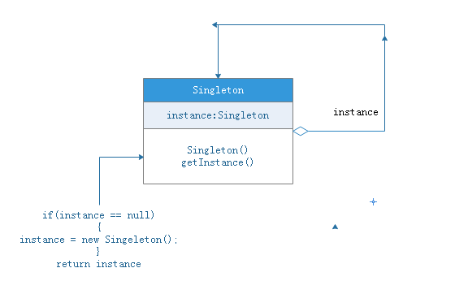
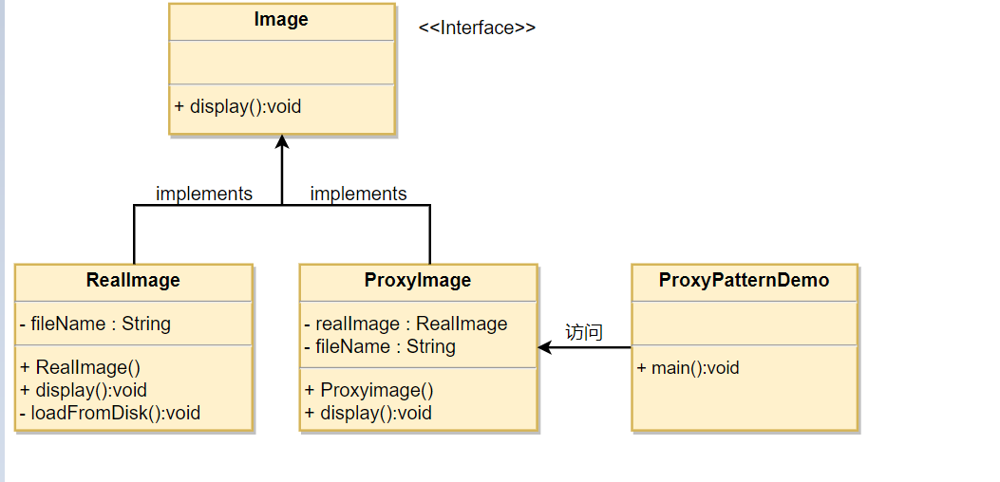

# Java设计模式

## 设计模式简介

**设计模式(Design pattern)**代表了最佳的实践，通常被有经验的面向对象的软件开发人员所采用。设计模式是软件开发人员在软件开发过程中面临的一般问题的解决方案。这些解决方案是众多软件开发人员经过相当长的一段时间的试验和错误总结出来的。

设计模式是一套被反复使用的、多数人知晓的、经过分类编目的、代码设计经验的总结。使用设计模式是为了重用代码、让代码更容易被他人理解、保证代码可靠性。 毫无疑问，设计模式于己于他人于系统都是多赢的，设计模式使代码编制真正工程化，设计模式是软件工程的基石，如同大厦的一块块砖石一样。项目中合理地运用设计模式可以完美地解决很多问题，每种模式在现实中都有相应的原理来与之对应，每种模式都描述了一个在我们周围不断重复发生的问题，以及该问题的核心解决方案，这也是设计模式能被广泛应用的原因。

## 设计模式的分类和功能

### 设计模式的分类

**创建型模式：对象实例化的模式，创建型模式用于解耦对象的实例化过程。**

**结构型模式：把类或对象结合在一起形成一个更大的结构。**

**行为型模式：类和对象如何交互，及划分责任和算法。**

根据设计模式的参考书 **Design Patterns - Elements of Reusable Object-Oriented Software（中文译名：设计模式 - 可复用的面向对象软件元素）** 中所提到的，总共有 23 种设计模式。这些模式可以分为三大类：创建型模式（Creational Patterns）、结构型模式（Structural Patterns）、行为型模式（Behavioral Patterns）。当然，我们还会讨论另一类设计模式：J2EE 设计模式。


### 23种设计模式的功能

前面说明了 GoF 的 23 种设计模式的分类，现在对各个模式的功能进行介绍。

1. 单例（Singleton）模式：某个类只能生成一个实例，该类提供了一个全局访问点供外部获取该实例，其拓展是有限多例模式。
2. 原型（Prototype）模式：将一个对象作为原型，通过对其进行复制而克隆出多个和原型类似的新实例。
3. 工厂方法（Factory Method）模式：定义一个用于创建产品的接口，由子类决定生产什么产品。
4. 抽象工厂（AbstractFactory）模式：提供一个创建产品族的接口，其每个子类可以生产一系列相关的产品。
5. 建造者（Builder）模式：将一个复杂对象分解成多个相对简单的部分，然后根据不同需要分别创建它们，最后构建成该复杂对象。
6. 代理（Proxy）模式：为某对象提供一种代理以控制对该对象的访问。即客户端通过代理间接地访问该对象，从而限制、增强或修改该对象的一些特性。
7. 适配器（Adapter）模式：将一个类的接口转换成客户希望的另外一个接口，使得原本由于接口不兼容而不能一起工作的那些类能一起工作。
8. 桥接（Bridge）模式：将抽象与实现分离，使它们可以独立变化。它是用组合关系代替继承关系来实现，从而降低了抽象和实现这两个可变维度的耦合度。
9. 装饰（Decorator）模式：动态的给对象增加一些职责，即增加其额外的功能。
10. 外观（Facade）模式：为多个复杂的子系统提供一个一致的接口，使这些子系统更加容易被访问。
11. 享元（Flyweight）模式：运用共享技术来有效地支持大量细粒度对象的复用。
12. 组合（Composite）模式：将对象组合成树状层次结构，使用户对单个对象和组合对象具有一致的访问性。
13. 模板方法（TemplateMethod）模式：定义一个操作中的算法骨架，而将算法的一些步骤延迟到子类中，使得子类可以不改变该算法结构的情况下重定义该算法的某些特定步骤。
14. 策略（Strategy）模式：定义了一系列算法，并将每个算法封装起来，使它们可以相互替换，且算法的改变不会影响使用算法的客户。
15. 命令（Command）模式：将一个请求封装为一个对象，使发出请求的责任和执行请求的责任分割开。
16. 职责链（Chain of Responsibility）模式：把请求从链中的一个对象传到下一个对象，直到请求被响应为止。通过这种方式去除对象之间的耦合。
17. 状态（State）模式：允许一个对象在其内部状态发生改变时改变其行为能力。
18. 观察者（Observer）模式：多个对象间存在一对多关系，当一个对象发生改变时，把这种改变通知给其他多个对象，从而影响其他对象的行为。
19. 中介者（Mediator）模式：定义一个中介对象来简化原有对象之间的交互关系，降低系统中对象间的耦合度，使原有对象之间不必相互了解。
20. 迭代器（Iterator）模式：提供一种方法来顺序访问聚合对象中的一系列数据，而不暴露聚合对象的内部表示。
21. 访问者（Visitor）模式：在不改变集合元素的前提下，为一个集合中的每个元素提供多种访问方式，即每个元素有多个访问者对象访问。
22. 备忘录（Memento）模式：在不破坏封装性的前提下，获取并保存一个对象的内部状态，以便以后恢复它。
23. 解释器（Interpreter）模式：提供如何定义语言的文法，以及对语言句子的解释方法，即解释器。

## 设计模式的六大原则

**1、开闭原则（Open Close Principle）**

开闭原则的意思是：**对扩展开放，对修改关闭**。在程序需要进行拓展的时候，不能去修改原有的代码，实现一个热插拔的效果。简言之，是为了使程序的扩展性好，易于维护和升级。想要达到这样的效果，我们需要使用接口和抽象类，后面的具体设计中我们会提到这点。

**2、里氏代换原则（Liskov Substitution Principle）**

里氏代换原则是面向对象设计的基本原则之一。 里氏代换原则中说，任何基类可以出现的地方，子类一定可以出现。LSP 是继承复用的基石，只有当派生类可以替换掉基类，且软件单位的功能不受到影响时，基类才能真正被复用，而派生类也能够在基类的基础上增加新的行为。里氏代换原则是对开闭原则的补充。实现开闭原则的关键步骤就是抽象化，而基类与子类的继承关系就是抽象化的具体实现，所以里氏代换原则是对实现抽象化的具体步骤的规范。

**3、依赖倒转原则（Dependence Inversion Principle）**

这个原则是开闭原则的基础，具体内容：针对接口编程，依赖于抽象而不依赖于具体。

**4、接口隔离原则（Interface Segregation Principle）**

这个原则的意思是：使用多个隔离的接口，比使用单个接口要好。它还有另外一个意思是：降低类之间的耦合度。由此可见，其实设计模式就是从大型软件架构出发、便于升级和维护的软件设计思想，它强调降低依赖，降低耦合。

**5、迪米特法则，又称最少知道原则（Demeter Principle）**

最少知道原则是指：一个实体应当尽量少地与其他实体之间发生相互作用，使得系统功能模块相对独立。

**6、合成复用原则（Composite Reuse Principle）**

合成复用原则是指：尽量使用合成/聚合的方式，而不是使用继承。

## 常用设计模式概述

### 单例模式

#### 简介

单例（Singleton）模式的定义：指一个类只有一个实例，且该类能自行创建这个实例的一种模式。例如，Windows 中只能打开一个任务管理器，这样可以避免因打开多个任务管理器窗口而造成内存资源的浪费，或出现各个窗口显示内容的不一致等错误。

**注意：**

- 1、单例类只能有一个实例。
- 2、单例类必须自己创建自己的唯一实例。
- 3、单例类必须给所有其他对象提供这一实例。

#### 优缺点

**优点**

* 单例模式可以保证内存里只有一个实例，减少了内存的开销。
* 可以避免对资源的多重占用。
* 单例模式设置全局访问点，可以优化和共享资源的访问。

**缺点**

- 单例模式一般没有接口，扩展困难。如果要扩展，则除了修改原来的代码，没有第二种途径，违背开闭原则。
- 在并发测试中，单例模式不利于代码调试。在调试过程中，如果单例中的代码没有执行完，也不能模拟生成一个新的对象。
- 单例模式的功能代码通常写在一个类中，如果功能设计不合理，则很容易违背单一职责原则。

#### 应用场景

- 要求生产唯一序列号。
- WEB 中的计数器，不用每次刷新都在数据库里加一次，用单例先缓存起来。
- 创建的一个对象需要消耗的资源过多，比如 I/O 与数据库的连接等。

**注意事项**

getInstance() 方法中需要使用同步锁 synchronized (Singleton.class) 防止多线程同时进入造成 instance 被多次实例化。

#### 结构与实现

单例模式的主要角色如下。

- 单例类：包含一个实例且能自行创建这个实例的类。
- 访问类：使用单例的类。



**第 1 种：懒汉式(线程不安全)**

```java
public class Singleton {  
    private static Singleton instance;  
    private Singleton (){}  
    public static Singleton getInstance() {  
    if (instance == null) {  
        instance = new Singleton();  
    }  
    return instance;  
    }  
}
```

**第 2种：饿汉式(线程安全)**

```java
public class Singleton {  
    private static Singleton instance = new Singleton();  
    private Singleton (){}  
    public static Singleton getInstance() {  
    	return instance;  
    }  
}
```

**第 3种：双重检索式(线程安全)**

```java
public class Singleton {  
    private volatile static Singleton singleton;  
    private Singleton (){}  
    public static Singleton getSingleton() {  
    if (singleton == null) {  
        synchronized (Singleton.class) {  
        if (singleton == null) {  
            singleton = new Singleton();  
        }  
        }  
    }  
    return singleton;  
    }  
}
```

### 工厂模式

#### 简介

工厂模式的定义：定义一个创建产品对象的工厂接口，将产品对象的实际创建工作推迟到具体子工厂类当中。这满足创建型模式中所要求的“创建与使用相分离”的特点。

**优点** 

1. 一个调用者想创建一个对象，只要知道其名称就可以了。
2. 扩展性高，如果想增加一个产品，只要扩展一个工厂类就可以。 
3. 屏蔽产品的具体实现，调用者只关心产品的接口。

**缺点**

每次增加一个产品时，都需要增加一个具体类和对象实现工厂，使得系统中类的个数成倍增加，在一定程度上增加了系统的复杂度，同时也增加了系统具体类的依赖。这并不是什么好事。

**使用场景** 

1. 日志记录器：记录可能记录到本地硬盘、系统事件、远程服务器等，用户可以选择记录日志到什么地方。 
2. 数据库访问，当用户不知道最后系统采用哪一类数据库，以及数据库可能有变化时。 
3. 设计一个连接服务器的框架，需要三个协议，"POP3"、"IMAP"、"HTTP"，可以把这三个作为产品类，共同实现一个接口。

**注意事项：**作为一种创建类模式，在任何需要生成复杂对象的地方，都可以使用工厂方法模式。有一点需要注意的地方就是复杂对象适合使用工厂模式，而简单对象，特别是只需要通过 new 就可以完成创建的对象，无需使用工厂模式。如果使用工厂模式，就需要引入一个工厂类，会增加系统的复杂度。

简单工厂模式每增加一个产品就要增加一个具体产品类和一个对应的具体工厂类，这增加了系统的复杂度，违背了“开闭原则”。

> “工厂方法模式”是对简单工厂模式的进一步抽象化，其好处是可以使系统在不修改原来代码的情况下引进新的产品，即满足开闭原则。

#### 优缺点

**优点** 

1. 一个调用者想创建一个对象，只要知道其名称就可以了。 
2. 扩展性高，如果想增加一个产品，只要扩展一个工厂类就可以。
3. 屏蔽产品的具体实现，调用者只关心产品的接口。

**缺点**

每次增加一个产品时，都需要增加一个具体类和对象实现工厂，使得系统中类的个数成倍增加，在一定程度上增加了系统的复杂度，同时也增加了系统具体类的依赖。这并不是什么好事。

#### 应用场景

1.  日志记录器：记录可能记录到本地硬盘、系统事件、远程服务器等，用户可以选择记录日志到什么地方。 
2.  数据库访问，当用户不知道最后系统采用哪一类数据库，以及数据库可能有变化时。 
3.  设计一个连接服务器的框架，需要三个协议，"POP3"、"IMAP"、"HTTP"，可以把这三个作为产品类，共同实现一个接口。

**注意事项**

作为一种创建类模式，在任何需要生成复杂对象的地方，都可以使用工厂方法模式。有一点需要注意的地方就是复杂对象适合使用工厂模式，而简单对象，特别是只需要通过 new 就可以完成创建的对象，无需使用工厂模式。如果使用工厂模式，就需要引入一个工厂类，会增加系统的复杂度。

#### 结构与实现

简单工厂模式的主要角色如下：

- 简单工厂（SimpleFactory）：是简单工厂模式的核心，负责实现创建所有实例的内部逻辑。工厂类的创建产品类的方法可以被外界直接调用，创建所需的产品对象。
- 抽象产品（Product）：是简单工厂创建的所有对象的父类，负责描述所有实例共有的公共接口。
- 具体产品（ConcreteProduct）：是简单工厂模式的创建目标。


**代码实现**

```java
/**
 * @author ITender
 * @create 2021-09-28 17:04
 */
public interface Shape {

    /**
     * 类型动作
     */
    void draw();
}

/**
 * @author ITender
 * @create 2021-09-28 17:05
 */
public class Cycle implements Shape {

    @Override
    public void draw() {
        System.out.println("Hello I'm a cycle;");
    }
}

/**
 * @author ITender
 * @create 2021-09-28 17:08
 */
public class Rectangle implements Shape {
    @Override
    public void draw() {
        System.out.println("Hello I'm a Rectangle;");
    }
}

/**
 * @author ITender
 * @create 2021-09-28 17:07
 */
public class Square implements Shape {
    @Override
    public void draw() {
        System.out.println("Hello I'm a Square;");
    }
}

/**
 * @author yuan
 * @create 2021-09-28 17:09
 */
public class ShapeFactory {

    public Shape getShape(String shapeType) {
        if (StringUtils.isEmpty(shapeType)) {
            return null;
        }
        switch (shapeType) {
            case "cycle":
                return new Cycle();
            case "rectangle":
                return new Rectangle();
            case "square":
                return new Square();
            default:
                return null;
        }
    }
}
```

### 抽象工厂模式

#### 简介

抽象工厂模式（Abstract Factory Pattern）是围绕一个超级工厂创建其他工厂。该超级工厂又称为其他工厂的工厂。这种类型的设计模式属于创建型模式，它提供了一种创建对象的最佳方式。

在抽象工厂模式中，接口是负责创建一个相关对象的工厂，不需要显式指定它们的类。每个生成的工厂都能按照工厂模式提供对象。

#### 优缺点

**优点**

当一个产品族中的多个对象被设计成一起工作时，它能保证客户端始终只使用同一个产品族中的对象。

**缺点**

产品族扩展非常困难，要增加一个系列的某一产品，既要在抽象的 Creator 里加代码，又要在具体的里面加代码。

#### 应用场景

1. QQ 换皮肤，一整套一起换。
2. 生成不同操作系统的程序。

**注意事项**

产品族难扩展，产品等级易扩展。

#### 结构与实现

我们将创建 *Shape* 和 *Color* 接口和实现这些接口的实体类。下一步是创建抽象工厂类 *AbstractFactory*。接着定义工厂类 *ShapeFactory* 和 *ColorFactory*，这两个工厂类都是扩展了 *AbstractFactory*。然后创建一个工厂创造器/生成器类 *FactoryProducer*。

*AbstractFactoryPatternDemo* 类使用 *FactoryProducer* 来获取 *AbstractFactory* 对象。它将向 *AbstractFactory* 传递形状信息 *Shape*（*CIRCLE / RECTANGLE / SQUARE*），以便获取它所需对象的类型。同时它还向 *AbstractFactory* 传递颜色信息 *Color*（*RED / GREEN / BLUE*），以便获取它所需对象的类型。


**代码实现**

```java
/**
 * @author yuan
 * @create 2021-09-28 17:04
 */
public interface Shape {

    /**
     * 类型动作
     */
    void draw();
}

/**
 * @author yuan
 * @create 2021-09-28 17:05
 */
public class Cycle implements Shape {

    @Override
    public void draw() {
        System.out.println("Hello I'm a cycle;");
    }
}

/**
 * @author yuan
 * @create 2021-09-28 17:08
 */
public class Rectangle implements Shape {
    @Override
    public void draw() {
        System.out.println("Hello I'm a Rectangle;");
    }
}

/**
 * @author yuan
 * @create 2021-09-28 17:30
 */
public interface Color {

    /**
     * 填充颜色
     */
    void fill();
}

/**
 * @author yuan
 * @create 2021-09-28 17:31
 */
public class Red implements Color {
    @Override
    public void fill() {
        System.out.println("Hello I'm RED");
    }
}

/**
 * @author yuan
 * @create 2021-09-28 17:31
 */
public class Green implements Color {
    @Override
    public void fill() {
        System.out.println("Hello I'm Green");
    }
}


/**
 * @author yuan
 * @create 2021-09-28 17:34
 */
public abstract class AbstractFactory {

    /**
     * 获取颜色
     * @param color
     * @return
     */
    public abstract Color getColor(String color);

    /**
     * 获取形状
     * @param shape
     * @return
     */
    public abstract Shape getShape(String shape);
}

/**
 * @author yuan
 * @create 2021-09-28 17:09
 */
public class ColorFactory extends AbstractFactory {

    @Override
    public Color getColor(String color) {
        if (StringUtils.isEmpty(color)) {
            return null;
        }
        switch (color) {
            case "red":
                return new Red();
            case "yellow":
                return new Yellow();
            case "green":
                return new Green();
            default:
                return null;
        }
    }

    @Override
    public Shape getShape(String shapeType) {
        return null;
    }
}

/**
 * @author yuan
 * @create 2021-09-28 17:09
 */
public class ShapeFactory extends AbstractFactory {

    @Override
    public Color getColor(String color) {
        return null;
    }

    @Override
    public Shape getShape(String shapeType) {
        if (StringUtils.isEmpty(shapeType)) {
            return null;
        }
        switch (shapeType) {
            case "cycle":
                return new Cycle();
            case "rectangle":
                return new Rectangle();
            case "square":
                return new Square();
            default:
                return null;
        }
    }
}
```

**测试代码**

```java
/**
 * @author yuan
 * @create 2021-09-28 17:40
 */
@RunWith(SpringRunner.class)
@SpringBootTest(classes = AbstractFactoryApplication.class)
public class AbstractFactoryTest {

    @Test
    public void testAbstractFactory() {
        //获取形状工厂
        AbstractFactory shapeFactory = FactoryProducer.getFactory("shape");

        //获取形状为 Circle 的对象
        Shape shape1 = shapeFactory.getShape("cycle");

        //调用 Circle 的 draw 方法
        shape1.draw();

        //获取形状为 Rectangle 的对象
        Shape shape2 = shapeFactory.getShape("rectangle");

        //调用 Rectangle 的 draw 方法
        shape2.draw();

        //获取形状为 Square 的对象
        Shape shape3 = shapeFactory.getShape("square");

        //调用 Square 的 draw 方法
        shape3.draw();

        //获取颜色工厂
        AbstractFactory colorFactory = FactoryProducer.getFactory("color");

        //获取颜色为 Red 的对象
        Color color1 = colorFactory.getColor("red");

        //调用 Red 的 fill 方法
        color1.fill();

        //获取颜色为 Green 的对象
        Color color2 = colorFactory.getColor("green");

        //调用 Green 的 fill 方法
        color2.fill();

        //获取颜色为 Blue 的对象
        Color color3 = colorFactory.getColor("yellow");

        //调用 Blue 的 fill 方法
        color3.fill();
    }
}
```

### 策略模式

#### 简介

在策略模式（Strategy Pattern）中，一个类的行为或其算法可以在运行时更改。这种类型的设计模式属于行为型模式。

在策略模式中，我们创建表示各种策略的对象和一个行为随着策略对象改变而改变的 context 对象。策略对象改变 context 对象的执行算法。

#### 优缺点

**优点** 

1. 算法可以自由切换。 
2. 避免使用多重条件判断。
3. 扩展性良好。

**缺点** 

1. 策略类会增多。
2. 所有策略类都需要对外暴露。

#### 应用场景

1. 如果在一个系统里面有许多类，它们之间的区别仅在于它们的行为，那么使用策略模式可以动态地让一个对象在许多行为中选择一种行为。
2. 一个系统需要动态地在几种算法中选择一种。
3. 如果一个对象有很多的行为，如果不用恰当的模式，这些行为就只好使用多重的条件选择语句来实现。

**注意事项**

如果一个系统的策略多于四个，就需要考虑使用混合模式，解决策略类膨胀的问题。

#### 结构与实现

**结构**

我们将创建一个定义活动的 *Strategy* 接口和实现了 *Strategy* 接口的实体策略类。*Context* 是一个使用了某种策略的类。

*StrategyPatternDemo*，我们的演示类使用 *Context* 和策略对象来演示 Context 在它所配置或使用的策略改变时的行为变化。


**代码实现**

```java
/**
 * @author yuan
 * @create 2021-09-29 11:01
 */
public interface Strategy {

    /**
     * 行为操作
     * @param num1
     * @param num2
     * @return
     */
    int doOperation(int num1, int num2);
}

/**
 * @author yuan
 * @create 2021-09-29 11:03
 */
public class Add implements Strategy {
    @Override
    public int doOperation(int num1, int num2) {
        return num1 + num2;
    }
}

/**
 * @author yuan
 * @create 2021-09-29 11:05
 */
public class Multiply implements Strategy {

    @Override
    public int doOperation(int num1, int num2) {
        return num1 * num2;
    }
}

/**
 * @author yuan
 * @create 2021-09-29 11:04
 */
public class Subtract implements Strategy {
    @Override
    public int doOperation(int num1, int num2) {
        return num1 - num2;
    }
}


/**
 * @author yuan
 * @create 2021-09-29 11:09
 */
public class Context {

    private Strategy strategy;

    public Context(Strategy strategy) {
        this.strategy = strategy;
    }

    public int executeStrategy(int num1, int num2) {
        return strategy.doOperation(num1, num2);
    }
}
```

**测试代码**

```java
/**
 * @author yuan
 * @create 2021-09-29 11:19
 */
@RunWith(SpringRunner.class)
@SpringBootTest(classes = StrategyApplication.class)
public class StrategyTest {
    @Autowired
    private RedisTemplate redisTemplate;

    @Test
    public void strategyTest1() {
        Context context = new Context(new Add());
        System.out.println(context.executeStrategy(20, 5));

        context = new Context(new Subtract());
        System.out.println(context.executeStrategy(20, 5));

        context = new Context(new Multiply());
        System.out.println(context.executeStrategy(20, 5));
    }
}
```

### 代理模式

#### 简介

在代理模式（Proxy Pattern）中，一个类代表另一个类的功能。这种类型的设计模式属于结构型模式。

在代理模式中，我们创建具有现有对象的对象，以便向外界提供功能接口。

#### 优缺点

**优点** 

1. 职责清晰。 
2. 高扩展性。 
3. 智能化。

**缺点** 

1. 由于在客户端和真实主题之间增加了代理对象，因此有些类型的代理模式可能会造成请求的处理速度变慢。
2. 实现代理模式需要额外的工作，有些代理模式的实现非常复杂。

#### 使用场景

1. 远程代理。 
2. 虚拟代理。 
3. Copy-on-Write 代理。 
4. 保护（Protect or Access）代理。 
5. Cache代理。
6. 防火墙（Firewall）代理。 
7. 同步化（Synchronization）代理。 
8. 智能引用（Smart Reference）代理。

**注意事项** 

1. 和适配器模式的区别：适配器模式主要改变所考虑对象的接口，而代理模式不能改变所代理类的接口。 
2. 和装饰器模式的区别：装饰器模式为了增强功能，而代理模式是为了加以控制。

#### 结构与实现



**结构**

我们将创建一个 *Image* 接口和实现了 *Image* 接口的实体类。*ProxyImage* 是一个代理类，减少 *RealImage* 对象加载的内存占用。

*ProxyPatternDemo* 类使用 *ProxyImage* 来获取要加载的 *Image* 对象，并按照需求进行显示。

**代码实现**

```java
/**
 * @author yuan
 * @create 2021-09-30 11:19
 */
public interface Image {
   void display();
}

/**
 * @author yuan
 * @create 2021-09-30 11:19
 */
public class RealImage implements Image {
   private String fileName;
 
   public RealImage(String fileName){
      this.fileName = fileName;
      loadFromDisk(fileName);
   }
 
   @Override
   public void display() {
      System.out.println("Displaying " + fileName);
   }
 
   private void loadFromDisk(String fileName){
      System.out.println("Loading " + fileName);
   }
}

/**
 * @author yuan
 * @create 2021-09-30 11:19
 */
public class ProxyImage implements Image{
   private RealImage realImage;
   private String fileName;
 
   public ProxyImage(String fileName){
      this.fileName = fileName;
   }
 
   @Override
   public void display() {
      if(realImage == null){
         realImage = new RealImage(fileName);
      }
      realImage.display();
   }
}
```

**测试代码**

```java
/**
 * @author yuan
 * @create 2021-09-30 11:22
 */
public class ProxyPatternTest {
   public static void main(String[] args) {
      Image image = new ProxyImage("test_10mb.jpg");
      // 图像将从磁盘加载
      image.display(); 
      System.out.println("");
      // 图像不需要从磁盘加载
      image.display();  
   }
}
```