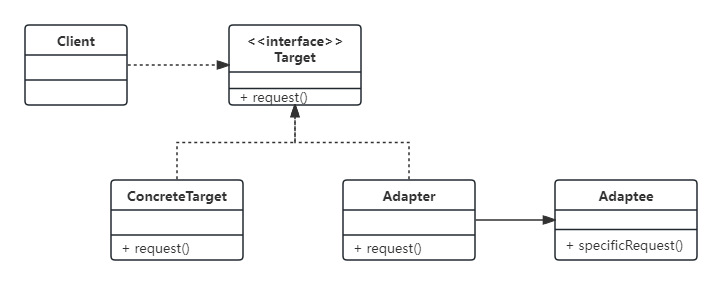

# Java设计模式-结构型-适配器模式

## 一、概述

​     与电源适配器相似，在适配器模式中引入了一个被称为适配器(Adapter)的包装类，而它所包装的对象称为适配者(Adaptee)，即被适配的类。适配器的实现就是把客户类的请求转化为对适配者的相应接口的调用。也就是说：当客户类调用适配器的方法时，在适配器类的内部将调用适配者类的方法，而这个过程对客户类是透明的，客户类并不直接访问适配者类。因此，适配器让那些由于接口不兼容而不能交互的类可以一起工作。

适配器模式可以将一个类的接口和另一个类的接口匹配起来，而无须修改原来的适配者接口和抽象目标类接口。适配器模式定义如下：

> 适配器模式(Adapter Pattern)：将一个接口转换成客户希望的另一个接口，使接口不兼容的那些类可以一起工作，其别名为包装器(Wrapper)。适配器模式既可以作为类结构型模式，也可以作为对象结构型模式。

所以，适配器模式比较适合以下场景：

- （1）系统需要使用现有的类，而这些类的接口不符合系统的接口。
- （2）使用第三方组件，组件接口定义和自己定义的不同，不希望修改自己的接口，但是要使用第三方组件接口的功能。

## 二、实现方式

**对象适配器模式和类适配器模式**



> - 目标接口（Target）：客户所期待的接口。目标可以是具体的或抽象的类，也可以是接口。
> - 需要适配的类（Adaptee）：需要适配的类或适配者类。
> - 适配器（Adapter）：通过包装一个需要适配的对象，把原接口转换成目标接口。

### 类适配器

在类适配器模式中，适配器与适配者之间是继承（或实现）关系。

- 目标接口

```java
/**
 * @author yuanhewei
 * @date 2024/2/18 17:44
 * @description
 */
public interface Target {

    /**
     * 请求
     */
    void request();
}
```

- 具体实现类

```java
/**
 * @author yuanhewei
 * @date 2024/2/18 18:00
 * @description
 */
public class ConcreteTarget implements Target {
    @Override
    public void request() {
        System.out.println("类适配器-ConcreteTarget: 普通的实现类，具有普通的功能！");
    }
}
```

- 适配者

```java
/**
 * @author yuanhewei
 * @date 2024/2/18 17:45
 * @description
 */
public class Adaptee {
    public void specificRequest() {
        System.out.println("类适配器-Adaptee: 需要被适配器包装的具有特殊功能的类！");
    }
}
```

- 适配器

```java
/**
 * @author yuanhewei
 * @date 2024/2/18 17:45
 * @description
 */
public class Adapter extends Adaptee implements Target{

    @Override
    public void request() {
        super.specificRequest();
    }
}
```

- 测试代码

```java
/**
 * @author yuanhewei
 * @date 2022-02-17 20:11
 */
@SpringBootTest
class ClassAdapterTest {

    @Test
    void testClassAdapter() {
        Target adapter = new Adapter();
        adapter.request();
        Target concreteTarget = new ConcreteTarget();
        concreteTarget.request();
    }
}
```

### 对象适配器

在对象适配器模式中，适配器与适配者之间是关联关系。

- 目标接口

```java
/**
 * @author yuanhewei
 * @date 2024/2/18 17:44
 * @description
 */
public interface Target {

    /**
     * 请求
     */
    void request();
}
```

- 具体实现类

```java
/**
 * @author yuanhewei
 * @date 2024/2/18 18:00
 * @description
 */
public class ConcreteTarget implements Target {
    @Override
    public void request() {
        System.out.println("类适配器-ConcreteTarget: 普通的实现类，具有普通的功能！");
    }
}
```

- 适配者

```java
/**
 * @author yuanhewei
 * @date 2024/2/18 17:45
 * @description
 */
public class Adaptee {
    public void specificRequest() {
        System.out.println("类适配器-Adaptee: 需要被适配器包装的具有特殊功能的类！");
    }
}
```

- 适配器

```java
/**
 * @author yuanhewei
 * @date 2024/2/18 17:45
 * @description
 */
@Service
public class Adapter implements Target {
    private Adaptee adaptee;

    public Adapter(Adaptee adaptee) {
        this.adaptee = adaptee;
    }

    @Override
    public void request() {
        adaptee.specificRequest();
    }
}
```

- 测试代码

```java
/**
 * @author yunehewei
 * @date 2022-02-17 20:11
 */
@SpringBootTest
class ObjectAdapterTest {

    @Test
    void testObjAdapter() {
        // 适配器
        Target adapter = new Adapter(new Adaptee());
        adapter.request();
        // 具体实现类
        Target concreteTarget = new ConcreteTarget();
        concreteTarget.request();
    }
}
```

从上面的代码可以看出，适配器必须有一个被适配的类的对象，然后通过Adapter适配器，把具有具体特殊的功能交给这个对象去实现。

在使用适配器模式时，可以使Adapter适配器通过传入的不同的Adaptee对象，实现多个不同的被适配的类的功能。当然，此时我们可以为多个被适配类提取出一个接口或抽象类。这样看起来的话，似乎对象适配器模式更加灵活一点。

## 参考

- https://blog.csdn.net/lovelion/article/details/8624325
- https://blog.csdn.net/a745233700/article/details/83628122

