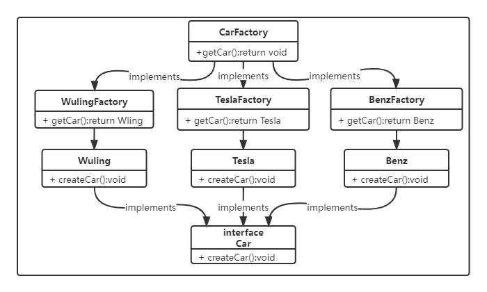

# 设计模式-工厂方法模式

本文我们简单说下[设计模式](https://blog.csdn.net/Y_eatMeat/article/details/123001650)中的工厂方法模式。

## 概述

工厂方法(Factory Method)模式，又称多态工厂(Polymorphic Factory)模式或虚拟构造器(Virtual Constructor)模式。工厂方法模式通过定义工厂抽象父类(或接口)负责定义创建对象的公共接口，而工厂子类(或实现类)则负责生成具体的对象。

工厂方法模式对简单工厂模式中的工厂类进一步抽象。核心工厂类不再负责产品的创建，而是演变为一个抽象工厂角色，仅负责定义具体工厂子类必须实现的接口。同时，针对不同的产品提供不同的工厂。即**每个产品都有一个与之对应的工厂**。这样，系统在增加新产品时就不会修改工厂类逻辑而是添加新的工厂子类，从而弥补简单工厂模式对修改开放的缺陷。

### 优点：

- 用户只需要知道具体工厂的名称就可得到所要的产品，无须知道产品的具体创建过程。
- 灵活性增强，对于新产品的创建，只需多写一个相应的工厂类。
- 典型的解耦框架。高层模块只需要知道产品的抽象类，无须关心其他实现类，满足迪米特法则、依赖倒置原则和里氏替换原则。

### 缺点：

- 类的个数容易过多，增加复杂度
- 增加了系统的抽象性和理解难度
- 抽象产品只能生产一种产品，此弊端可使用抽象工厂模式解决。

### 应用场景：

- 客户只知道创建产品的工厂名，而不知道具体的产品名。如 TCL 电视工厂、海信电视工厂等。
- 创建对象的任务由多个具体子工厂中的某一个完成，而抽象工厂只提供创建产品的接口。
- 客户不关心创建产品的细节，只关心产品的品牌

## 结构代码

talk is cheap show me the code。废话少说，直接上代码。



**定义汽车接口**

```java
package com.itender.design.factory.method;

/**
 * @Author: ITender
 * @CreateTime: 2022-02-17 20:27
 */
public interface Car {

    /**
     * 根据名字获取车辆
     */
    void createCar();
}

```

**多个汽车接口实现**

```java
package com.itender.design.factory.method;

/**
 * @Author: ITender
 * @Description:
 * @CreateTime: 2022-02-17 20:34
 */
public class Benz implements Car {
    @Override
    public void createCar() {
        System.out.println("我是奔驰！");
    }
}
```

```java
package com.itender.design.factory.method;

/**
 * @Author: ITender
 * @Description:
 * @CreateTime: 2022-02-17 20:29
 */
public class Tesla implements Car {
    @Override
    public void createCar() {
        System.out.println("我是特斯拉！");
    }
}

```

```java
package com.itender.design.factory.method;

/**
 * @Author: ITender
 * @Description:
 * @CreateTime: 2022-02-17 20:27
 */
public class Wuling implements Car {
    @Override
    public void createCar() {
        System.out.println("我是五菱宏光！");
    }
}
```

**定义工厂接口，用于生产汽车**

```java
package com.itender.design.factory.method;

/**
 * @Author: ITender
 * @CreateTime: 2022-02-17 20:51
 */
public interface CarFactory {

    /**
     * 获取汽车
     * @return
     */
    Car getCar();
}

```

**工厂实现类**

```java
package com.itender.design.factory.method;

/**
 * @Author: ITender
 * @Description: 奔驰工厂，生产奔驰车
 * @CreateTime: 2022-02-17 20:53
 */
public class BenzFactory implements CarFactory {
    @Override
    public Car getCar() {
        return new Benz();
    }
}

```

```java
package com.itender.design.factory.method;

/**
 * @Author: ITender
 * @Description: 特斯拉工厂，生产特斯拉车
 * @CreateTime: 2022-02-17 20:52
 */
public class TeslaFactory implements CarFactory {
    @Override
    public Car getCar() {
        return new Tesla();
    }
}

```

```java
package com.itender.design.factory.method;

/**
 * @Author: ITender
 * @Description: 五菱工厂，生产五菱车
 * @CreateTime: 2022-02-17 20:53
 */
public class WulingFactory implements CarFactory {
    @Override
    public Car getCar() {
        return new Wuling();
    }
}

```

**测试类编写**

```java
package com.itender.design.factory.method;

/**
 * @Author: ITender
 * @Description: 工厂方法模式测试类
 * @CreateTime: 2022-02-17 20:30
 */
public class Consumer {
    public static void main(String[] args) {
        Car tesla = new TeslaFactory().getCar();
        Car wuling = new WulingFactory().getCar();
        Car benz = new BenzFactory().getCar();
        wuling.createCar();
        tesla.createCar();
        benz.createCar();
    }
}

```

**输出**


