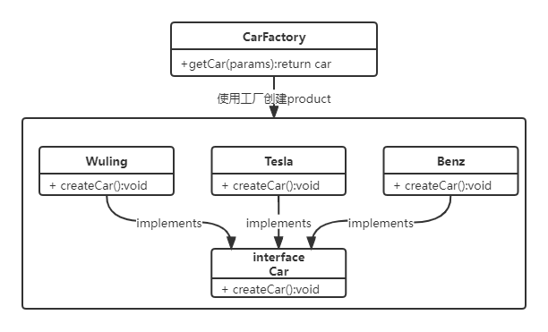

# 设计模式-简单工厂模式

本文我们简单说下[设计模式](https://blog.csdn.net/Y_eatMeat/article/details/123001650)中的简单工厂模式。

## 概述

简单工厂模式是属于创建型模式，又叫做静态工厂方法（Static Factory Method）模式，但不属于23种GOF设计模式之一。简单工厂模式是由一个工厂对象决定创建出哪一种产品类的实例。简单工厂模式是工厂模式家族中最简单实用的模式，可以理解为是不同工厂模式的一个特殊实现。

## 简单工厂模式优缺点

**优点**

- 工厂类含有必要的判断逻辑，可以决定在什么时候创建哪一个产品类的实例，客户端可以免除直接创建产品对象的责任，而仅仅“消费”产品；简单工厂模式通过这种做法实现了对责任的分割，它提供了专门的工厂类用于创建对象。
- 客户端无须知道所创建的具体产品类的类名，只需要知道具体产品类所对应的参数即可，对于一些复杂的类名，通过简单工厂模式可以减少使用者的记忆量。
- 通过引入配置文件，可以在不修改任何客户端代码的情况下更换和增加新的具体产品类，在一定程度上提高了系统的灵活性。

**缺点**

- 由于工厂类集中了所有产品创建逻辑，一旦不能正常工作，整个系统都要受到影响。
- 使用简单工厂模式将会增加系统中类的个数，在一定程序上增加了系统的复杂度和理解难度。
- 系统扩展困难，一旦添加新产品就不得不修改工厂逻辑，在产品类型较多时，有可能造成工厂逻辑过于复杂，不利于系统的扩展和维护。

## 结构代码

talk is cheap show me the code。废话少说，直接上代码。



```java
package com.itender.design.factory.simple;

/**
 * @Author: ITender
 * @CreateTime: 2022-02-17 20:27
 */
public interface Car {

    /**
     * 根据名字获取车辆
     */
    void createCar();
}

```

```java
package com.itender.design.factory.simple;

/**
 * @Author: ITender
 * @Description:
 * @CreateTime: 2022-02-17 20:34
 */
public class Benz implements Car {
    @Override
    public void createCar() {
        System.out.println("奔驰！");
    }
}

```

```java
package com.itender.design.factory.simple;

/**
 * @Author: ITender
 * @Description:
 * @CreateTime: 2022-02-17 20:29
 */
public class Tesla implements Car {
    @Override
    public void createCar() {
        System.out.println("特斯拉！");
    }
}

```

```java
package com.itender.design.factory.simple;

/**
 * @Author: ITender
 * @Description:
 * @CreateTime: 2022-02-17 20:27
 */
public class Wuling implements Car {
    @Override
    public void createCar() {
        System.out.println("五菱宏光！");
    }
}

```

工厂类：

```java
package com.itender.design.factory.simple;

import com.itender.design.factory.method.Benz;
import com.itender.design.factory.method.Car;
import com.itender.design.factory.method.Tesla;
import com.itender.design.factory.method.Wuling;

/**
 * @Author: ITender
 * @Description:
 * @CreateTime: 2022-02-17 20:32
 */
public class CarFactory {

    public static Car getCar(String name) {
        if ("wuling".equals(name)) {
            return new Wuling();
        } else if ("tesla".equals(name)) {
            return new Tesla();
        } else if ("benz".equals(name)) {
            return new Benz();
        }
        return null;
    }
}

```

测试类：

```java
package com.itender.design.factory.simple;

/**
 * @Author: ITender
 * @Description:
 * @CreateTime: 2022-02-17 20:30
 */
public class Consumer {
    public static void main(String[] args) {
        Car wuling = (Car) CarFactory.getCar("wuling");
        Car tesla = (Car) CarFactory.getCar("tesla");
        Car benz = (Car) CarFactory.getCar("benz");
        wuling.createCar();
        tesla.createCar();
        benz.createCar();

    }
}
```
