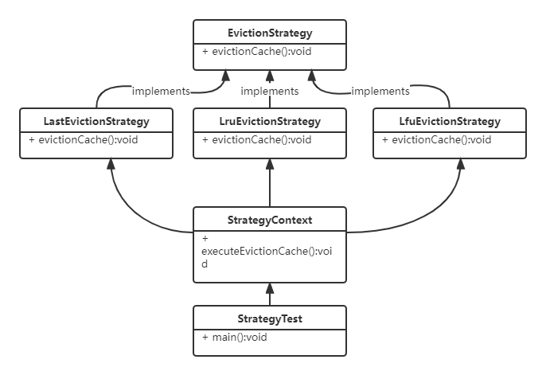
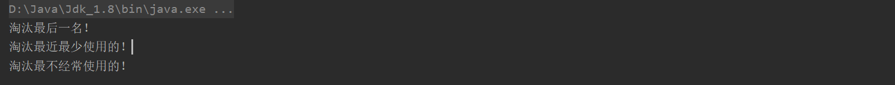

# 设计模式-策略模式

本文我们简单说下[设计模式](https://blog.csdn.net/Y_eatMeat/article/details/123001650)中的简策略模式。

## 策略模式概述

在策略模式（Strategy Pattern）中，一个类的行为或其算法可以在运行时更改。这种类型的设计模式属于行为型模式。

在策略模式中，我们创建表示各种策略的对象和一个行为随着策略对象改变而改变的 context 对象。策略对象改变 context 对象的执行算法。

### 策略模式优缺点

**优点** 

1. 算法可以自由切换。 
2. 避免使用多重条件判断。
3. 扩展性良好。

**缺点** 

1. 策略类会增多。
2. 所有策略类都需要对外暴露。

### 应用场景

1. 如果在一个系统里面有许多类，它们之间的区别仅在于它们的行为，那么使用策略模式可以动态地让一个对象在许多行为中选择一种行为。
2. 一个系统需要动态地在几种算法中选择一种。
3. 如果一个对象有很多的行为，如果不用恰当的模式，这些行为就只好使用多重的条件选择语句来实现。

## 策略模式结构



## 代码实现

talk is cheap show me the code。废话少说，直接上代码。

```java
package com.itender.design.strategy;

/**
 * @Author: ITender
 * @CreateTime: 2022-02-19 21:30
 * @Description: 淘汰策略
 */
public interface EvictionStrategy {
    /**
     * 淘汰方法
     */
    void evictionCache();
}

```

```java
package com.itender.design.strategy;


import lombok.extern.slf4j.Slf4j;

/**
 * @Author: ITender
 * @CreateTime: 2022-02-19 21:33
 * @Description: 淘汰最后
 */
public class LastEvictionStrategy implements EvictionStrategy {

    @Override
    public void evictionCache() {
        System.out.println("淘汰最后一名！");
    }
}
```

```java
package com.itender.design.strategy;


/**
 * @Author: ITender
 * @CreateTime: 2022-02-19 21:33
 * @Description: 淘汰最不经常使用的
 */
public class LfuEvictionStrategy implements EvictionStrategy {

    @Override
    public void evictionCache() {
        System.out.println("淘汰最不经常使用的！");
    }
}
```

```java
package com.itender.design.strategy;


/**
 * @Author: ITender
 * @CreateTime: 2022-02-19 21:33
 * @Description: 淘汰最近最少使用的
 */
public class LruEvictionStrategy implements EvictionStrategy {

    @Override
    public void evictionCache() {
        System.out.println("淘汰最近最少使用的！");
    }
}
```

```java
package com.itender.design.strategy;

/**
 * @Author: ITender
 * @CreateTime: 2022-02-19 21:47
 * @Description: 淘汰类型枚举
 */
public enum EvictionType {
    LAST("last","淘汰最后一名"),
    LRU("lru","淘汰最近最少使用"),
    LFU("lfu", "淘汰最不经常使用的");

    EvictionType(String code, String name) {
        this.code = code;
        this.name = name;
    }

    private String code;

    private String name;

    public String getCode() {
        return code;
    }

    public String getName() {
        return name;
    }

    public EvictionType evictionType(String code) {
        if (LAST.code.equals(code)) {
            return LAST;
        }else if (LRU.code.equals(code)) {
            return LRU;
        }else if (LFU.code.equals(code)) {
            return LFU;
        }
        return null;
    }


}
```

```java
package com.itender.design.strategy;

import java.util.HashMap;
import java.util.Map;

import static com.itender.design.strategy.EvictionType.*;

/**
 * @Author: ITender
 * @CreateTime: 2022-02-19 21:46
 * @Description: 策略工厂
 */
public class StrategyFactory {
    public static Map<EvictionType, EvictionStrategy> evictionMap = new HashMap<>();

    static {
        evictionMap.put(LAST, new LastEvictionStrategy());
        evictionMap.put(LRU, new LruEvictionStrategy());
        evictionMap.put(LFU, new LfuEvictionStrategy());
    }

    public static EvictionStrategy getEvictionStrategy(EvictionType evictionType) {
        return evictionMap.get(evictionType);
    }
}
```

**测试代码**

```java
package com.itender.design.strategy;

/**
 * @Author: ITender
 * @CreateTime: 2022-02-19 22:00
 * @Description: 策略模式测试类
 */
public class StrategyTest {
    public static void main(String[] args) {
        EvictionStrategy lastStrategy = StrategyFactory.getEvictionStrategy(EvictionType.LAST);
        lastStrategy.evictionCache();

        EvictionStrategy lruStrategy = StrategyFactory.getEvictionStrategy(EvictionType.LRU);
        lruStrategy.evictionCache();

        EvictionStrategy lfuStrategy = StrategyFactory.getEvictionStrategy(EvictionType.LFU);
        lfuStrategy.evictionCache();
    }
}

```

**输出**

